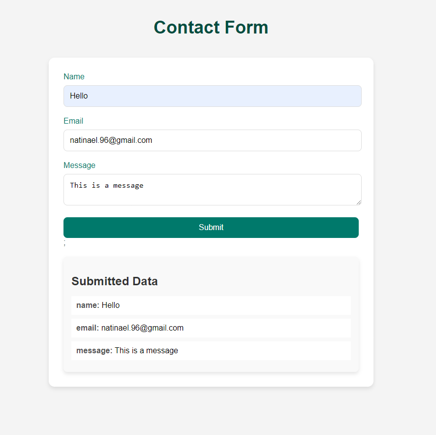

# Contact Form Component

This is a React component for a contact form built using TypeScript and the `react-hook-form` library. The component allows users to submit their name, email address, and a message, with validation for each field. The form displays error messages if the validation criteria are not met and shows the submitted data once the form is successfully submitted.

## Features

- **Form Validation**:
  - **Name**: Required field with a maximum length of 20 characters.
  - **Email**: Required field with validation for correct email format.
  - **Message**: Required field with a minimum length of 10 characters.

- **Error Handling**:
  - Displays relevant error messages for each field if the input does not meet the specified validation rules.

- **Data Display**:
  - Shows the submitted data (name, email, and message) once the form is successfully submitted and validated.

   
   

## Dependencies

- `react`
- `react-hook-form`

## Installation

1. Clone the repository:

   ```bash
   git clone <repository-url>
   ```

2. Navigate to the project directory:

   ```bash
   cd <project-directory>
   ```

3. Install the dependencies:

   ```bash
   npm install
   ```

4. Start the development server:

   ```bash
   npm start
   ```

### Usage

Import the `ContactForm` component into your React application and include it in your component tree:

```tsx
import ContactForm from './ContactForm';

// In your component
<ContactForm />
```

### Styling

Custom styles for the contact form are provided in `ContactForm.css`. You can modify these styles to fit the design of your application.
